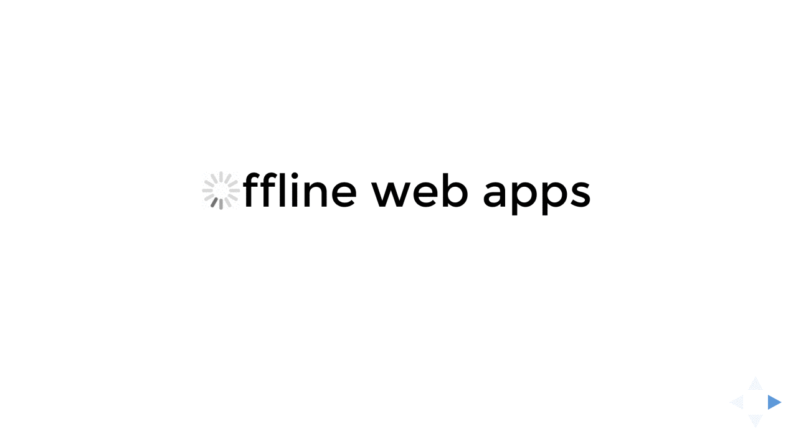

# Offline webapps

This document should cover basic of how to write offline web applications.

## TOC

1. [Intro](#intro)
2. [Presentation](#presentation)
3. [Online/Offline status](#onlineoffline-status)
4. [Application cache](#application-cache)
5. [Service Workers](#service-workers)
6. [Storage](#storage)
7. [localStorage](#localstorage)
8. [WebSQL](#websql)
9. [IndexedDB](#indexeddb)

## Intro

## Presentation

[Offline web apss presentation on slides.com.](http://slides.com/slobodan/offline-web-apps)

<p align="center">
  <a href="http://slides.com/slobodan/offline-web-apps" style="overflow: hidden; display: block; border: 2px solid #EEE">
    
  </a>
</p>

## Online/Offline status
[](https://html.spec.whatwg.org/multipage/browsers.html#browser-state)

Before we dive deep into offline web application, you would probably like to know if user is online and to receive an event when that status is changed.  
Fortunately almost all browsers implements this feature.

### `navigator.onLine` property

The `navigator.onLine` property is a read-only property that returns user's current online status. As defined in specs it must return false if the user agent will not contact the network when the user follows links or when a script requests a remote page (or knows that such an attempt would fail), and must return true otherwise.

This sounds good, but as always, it's a bit different in reality. Some browsers implemented this feature differently - on Chrome and Safari this property will return `false` if user can't connect on the network, in Firefox and Internet Explorer switching browser to an offline more will return `false`.

Usage:

```js
// From a browser
window.navigator.onLine // true or false

// From a worker
self.navigator.onLine // true or false

// Or simply
navigator.onLine // true or false
```

### `online` and `offline` events

Whenever online status is changed online or offline event is fired on body of each page and it bubbles up to document and finally window. Both of those events are not cancelable.

There's 3 ways of registering listeners for those events:

1. By adding an event listener on body, document or window (or self in case of a web worker);
2. By setting `.ononline` and `.onoffline` properties on document or body;
3. By defining `ononline=""`and `onoffline=""` attribute in `<body>` tag.

Usage:

```js
// Add an event listener on window, document or body
window.addEventListener('offline', e => console.log('offline'))
window.addEventListener('online', e => console.log('online'))

// Or by using .ononline and .onoffline on document or body
document.body.ononline = () => console.log('online')
document.body.onoffline = () => console.log('offline')

// From a worker
self.addEventListener('offline', e => self.postMessage('offline'), false)
self.addEventListener('online', e => self.postMessage('online'), false)
```

### Tricky parts

1. It seems that the events are not triggered in the worker on Chrome (tested on Mac on versions 47 and Chrome Canary v49). Events works fine on Safari and Firefox.
2. `.ononline` and `.onoffline` properties can't be used on `window`, from [MDN](https://developer.mozilla.org/en-US/docs/Web/API/Document/ononline): "**Note:** using `window.ononline` or `window.onoffline` will not work for compatibility reasons."
3. In Firefox, prior to version 41 `navigator.onLine` property returned `false` only if you are in an offline mode, and from version 41 on OS X and Windows, the value should follow the actual network connectivity.
4. As noted in specs, this attribute is inherently unreliable. A computer can be connected to a network without having Internet access. Most of the browsers just checks if the device is connected to any network, not if it is able to access the internet.
5. Offline event is not triggered when you use Chrome Dev tools' Network throttling to simulate an offline mode.
6. `self.ononline` and `self.onoffline` seems to be working only on Safari on Mac.

### Demo

- [HTML5Demos.com - Offline](http://html5demos.com/offline)

### Browser support


Source: [caniuse.com](http://caniuse.com/#feat=online-status); Date: 2015/12/26.

### More info

- [Specs](https://html.spec.whatwg.org/multipage/browsers.html#browser-state)
- [MDN: Online and offline events](https://developer.mozilla.org/en/docs/Online_and_offline_events)
- [HTML5 Demos](http://html5demos.com/offline)

[[Back to top]](#offline-webapps)

## Application cache
[](https://html.spec.whatwg.org/multipage/browsers.html#offline)

[TODO: Add better introduction section]

Beside online status, HTML5 introduced another, much more useful, resource for the real offline web apps - Application cache.

Application Cache (AppCache) provides an interface to specify resources that browser should cache an make available in an offline mode, even if user refreshes the page. Beside all pitfalls and tricky parys, there's a few clear benefits that AppCache brought:

1. **Offline browsing** - finally web apps become fully available without an internet connection
2. **Speed** - cached resources are local, and therefore load faster
3. **Reduced server load** - the browser only downloads changed or non-cached resources from the server

AppCache is deprecated in favor of a new and more powerful [Service Workers](#service-workers), but until Service Workers gain better browser support you'll still need AppCache for cross-browser offline web apps.

### Syntax

To enable app cache for the app, you'll need to include manifest attribute in `<html>` tag. Manifest attribute must be included on each page you want to cache, and it can point to relative or absolute url within the same origin.

Manifest file can have any extension as long as it is served with a correct mime-type - `text/cache-manifest`. This might require additional config on the server side.

```html
<!-- You can use relative url -->
<html manifest="example.appcache">

<!-- Or an absolute url with the same origin -->
<html manifest="https://example.com/example.appcache">

<!-- And any extension is supported if the file is served with the correct mime-type -->
<html manifest="example.cache">
``` 

Manifest file itself is a very simple textual file that can have three sections - cache, network and fallback - and it looks like this:

```yaml
CACHE MANIFEST
# v1 2016-01-10
# Line above is just a simple comment,
# but it is a good practice to version your manifest file,
# see an explanation bellow

# A list of files that needs to be cached
CACHE:
example.html
styles.css
img/someimage.png

# Section that always requires an internet access and that will not be available offline
NETWORK:
/api

# Fallback content that will be served to the offline users
FALLBACK:
/some-url offline.html
```

**CACHE Section:**  
This is the default section. All files listed in this section or right below "CACHE MANIFEST" title will be cached as soon as they are downloaded for the first time. Those files will be served from cache until both cache manifest and the file are not updated.

**NETWORK Section:**  
Files listed in this section may come from the internet if they are not cached. If the file isn't cached in the CACHE section and isn't listed in this section it'll not be loaded even if user is online.  
You can specify separate files or `*` in this section. For the most of the websites `*` is preffered if not even required.  
This section is optional

**FALLBACK Section:**  
This section is opional and it defines a fallback for files that are not accessible. ie. if you don't want to cache all large images for an offline use you can specify an offline placeholder image, or you can do something like a Google Chrome's offline dinosaur game for your website.  
The first URI is a resource and the secon is fallback. Both of them must have the same origin as a manifest file itself.

**Comments:**  
Each line that starts with `#` is a comment line and it's ignored by the cache.
But since the files are not re-downloaded until the cache manifest file is not updated, it's a good practice to version of your manifest file in the comment or to add a timestamp.

**Note:** Order of the sections is not important and they can be defined more than once.

### Updating the cache

### Tricky parts

### How and when to use it

### Demo

- [Appcache Offline Technology Demo](http://appcache.offline.technology/demo/)

### Browser support


Source: [caniuse.com](http://caniuse.com/#feat=offline-apps); Date: 2015/12/26.

### More info

- [Specs](https://html.spec.whatwg.org/multipage/browsers.html#offline)
- [MDN: Using application cache](https://developer.mozilla.org/en-US/docs/Web/HTML/Using_the_application_cache)
- [HTML5Rocks: A Beginner's Guide to Using the Application Cache](http://www.html5rocks.com/en/tutorials/appcache/beginner/)
- [Appcache Facts](http://appcache.offline.technology)
- [Application Cache is a Douchebag](http://alistapart.com/article/application-cache-is-a-douchebag)

[[Back to top]](#offline-webapps)

## Service workers
[](http://www.w3.org/TR/service-workers/)

Service worker is a script that is run in the background (separate tab) by the browser. It essentially acts as a proxy server that sits between web applications, the browser and network (when available).

### Syntax

Basic cache example:

```js
const CACHE_NAME = 'offline-web-apps-cache-v1'
const urlsToCache = [
  '/',
  '/scripts/main.js',
  '/styles/main.css',
]

self.addEventListener('install', event =>
  event.waitUntil(
    caches.open(CACHE_NAME)
      .then(cache => {
        console.log(`Cache (${CACHE_NAME}) is opened`)
        return cache.addAll(urlsToCache)
      })
  )
)
```

Cache requests:

```js
self.addEventListener('fetch', event =>
  event.respondWith(
    caches.match(event.request)
      .then(response => {
        // Cache hit - return response
        if (response)
          return response

        return fetch(event.request)
      })
  )
)
```
Updating service worker:

```js
this.addEventListener('install', event =>
  event.waitUntil(
    caches.open('offline-web-apps-cache-v2')
      .then(cache =>
        cache.addAll([
          '/sw-test/',
          '/sw-test/index.html',
          '/sw-test/style.css',
          '/sw-test/app.js',
          '/sw-test/image-list.js'
          // …
          // include other new resources for the new version...
        ])
      )
  )
)
```

Deleting old cache:

```js
this.addEventListener('activate', event => {
  const cacheWhitelist = ['offline-web-apps-cache-v2']

  event.waitUntil(
    caches.keys().then(keyList =>
      Promise.all(keyList.map(key => {
        if (cacheWhitelist.indexOf(key) === -1)
          return caches.delete(key)
      }))
    )
  )
})
```

### Demo

- [Offline news service](https://offline-news-service-worker.herokuapp.com)

### Browser support


Source: [caniuse.com](http://caniuse.com/#feat=serviceworkers); Date: 2015/12/26.

### More info

- [Specs](http://www.w3.org/TR/service-workers/)

[[Back to top]](#offline-webapps)

## Storage


## localStorage
[](http://www.w3.org/TR/webstorage/)

The localStorage property allows you to access a local Storage object.  
localStorage is similar to sessionStorage. The only difference is that, while data stored inlocalStorage has no expiration time, data stored in sessionStorage gets cleared when the browsing session ends - that is, when the browser is closed.

### Demo

- [HTML5Demos.com - Storage](http://html5demos.com/storage)

### Browser support


Source: [caniuse.com](http://caniuse.com/#feat=namevalue-storage); Date: 2015/12/26.

### More info

- [Specs](http://www.w3.org/TR/webstorage/)

[[Back to top]](#offline-webapps)

## WebSQL
[](http://www.w3.org/TR/webdatabase/)

### Demo

- [WebSQL vs. IdexedDB](http://ido-green.appspot.com/WebSQL-IndexedDB-example/main.html)

### Browser support


Source: [caniuse.com](http://caniuse.com/#feat=sql-storage); Date: 2015/12/26.

### More info

- [Specs](http://www.w3.org/TR/webdatabase/)

[[Back to top]](#offline-webapps)

## IndexedDB
[](http://www.w3.org/TR/IndexedDB/)

IndexedDB is a low-level API for client-side storage of significant amounts of structured data, including files/blobs.

### Demo

- [Stickies](http://www.girliemac.com/stickies/)
- [Web workers example](https://bl.ocks.org/nolanlawson/863e464f3025d7199a1f)

### Browser support


Source: [caniuse.com](http://caniuse.com/#feat=indexeddb); Date: 2015/12/26.

### More info

- [Specs](http://www.w3.org/TR/IndexedDB/)
- [MDC - IndexedDB API](https://developer.mozilla.org/en-US/docs/Web/API/IndexedDB_API)
- [HTML5Rocks - Migrating your WebSQL DB to IndexedDB](http://www.html5rocks.com/en/tutorials/webdatabase/websql-indexeddb/)

[[Back to top]](#offline-webapps)