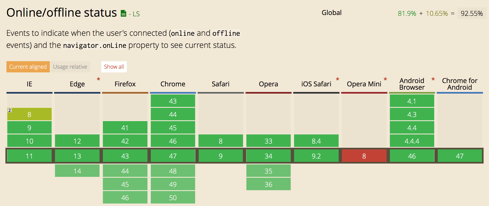
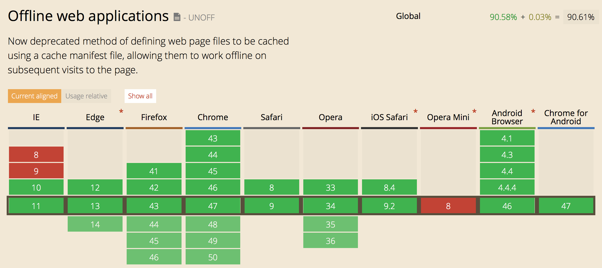
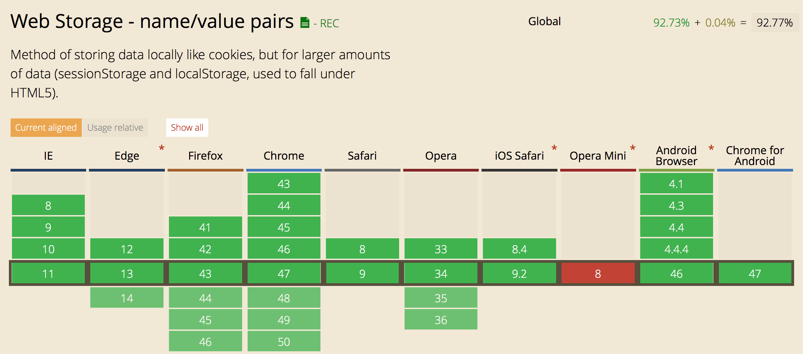
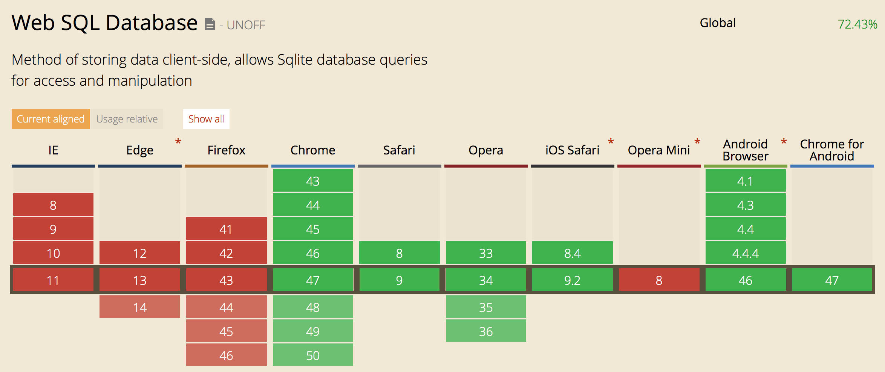
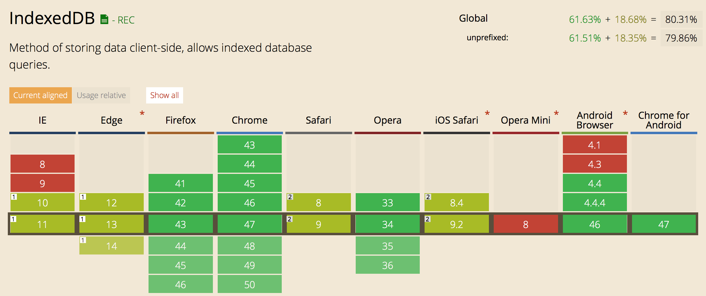

# Offline webapps

This document should cover basic of how to write offline web applications.

## TOC

1. [Intro](#intro)
2. [Online/Offline status](#onlineoffline-status)
3. [Application cache](#application-cache)
4. [Service Workers](#service-workers)
5. [Storage](#storage)
6. [localStorage](#localstorage)
7. [WebSQL](#websql)
8. [IndexedDB](#indexeddb)

## Intro

## Online/Offline status
[](https://html.spec.whatwg.org/multipage/browsers.html#browser-state)

Before we dive deep into offline web application, you would probably like to know if user is online and to receive an event when that status is changed.  
Fortunately almost all browsers implements this feature.

### `navigator.onLine` property

The `navigator.onLine` property is a read-only property that returns user's current online status. As defined in specs it must return false if the user agent will not contact the network when the user follows links or when a script requests a remote page (or knows that such an attempt would fail), and must return true otherwise.

This sounds good, but as always, it's a bit different in reality. Some browsers implemented this feature differently - on Chrome and Safari this property will return `false` if user can't connect on the network, in Firefox and Internet Explorer switching browser to an offline more will return `false`.

Usage:

```js
// From a browser
window.navigator.onLine // true or false

// From a worker
self.navigator.onLine // true or false

// Or simply
navigator.onLine // true or false
```

### `online` and `offline` events

Whenever online status is changed online or offline event is fired on body of each page and it bubbles up to document and finally window. Both of those events are not cancelable.

There's 3 ways of registering listeners for those events:

1. By adding an event listener on body, document or window (or self in case of a web worker);
2. By setting `.ononline` and `.onoffline` properties on document or body;
3. By defining `ononline=""`and `onoffline=""` attribute in `<body>` tag.

Usage:

```js
// Add an event listener on window, document or body
window.addEventListener('offline', e => console.log('offline'))
window.addEventListener('online', e => console.log('online'))

// Or by using .ononline and .onoffline on document or body
document.body.ononline = () => console.log('online')
document.body.onoffline = () => console.log('offline')

// From a worker
self.addEventListener('offline', e => self.postMessage('offline'), false)
self.addEventListener('online', e => self.postMessage('online'), false)
```

### Tricky parts

1. It seems that the events are not triggered in the worker on Chrome (tested on Mac on versions 47 and Chrome Canary v49). Events works fine on Safari and Firefox.
2. `.ononline` and `.onoffline` properties can't be used on `window`, from [MDN](https://developer.mozilla.org/en-US/docs/Web/API/Document/ononline): "**Note:** using `window.ononline` or `window.onoffline` will not work for compatibility reasons."
3. In Firefox, prior to version 41 `navigator.onLine` property returned `false` only if you are in an offline mode, and from version 41 on OS X and Windows, the value should follow the actual network connectivity.
4. As noted in specs, this attribute is inherently unreliable. A computer can be connected to a network without having Internet access. Most of the browsers just checks if the device is connected to any network, not if it is able to access the internet.
5. Offline event is not triggered when you use Chrome Dev tools' Network throttling to simulate an offline mode.
6. `self.ononline` and `self.onoffline` seems to be working only on Safari on Mac.

### Demo


### Browser support


Source: [caniuse.com](http://caniuse.com/#feat=online-status); Date: 2015/12/26.

### More info

- [Specs](https://html.spec.whatwg.org/multipage/browsers.html#browser-state)
- [MDN: Online and offline events](https://developer.mozilla.org/en/docs/Online_and_offline_events)
- [HTML5 Demos](http://html5demos.com/offline)

[[Back to top]](#offline-webapps)

## Application cache
[](https://html.spec.whatwg.org/multipage/browsers.html#offline)

Beside online status, HTML5 introduced another, much more useful, resource for the real offline web apps - Application cache.

Application Cache (AppCache) provides an interface to specify resources that browser should cache an make available in an offline mode, even if user refreshes the page. Beside all pitfalls and tricky parys, there's a few clear benefits that AppCache brought:

1. **Offline browsing** - finally web apps become fully available without an internet connection
2. **Speed** - cached resources are local, and therefore load faster
3. **Reduced server load** - the browser only downloads changed or non-cached resources from the server

AppCache is deprecated in favor of a new and more powerful [Service Workers](#service-workers), but until Service Workers gain better browser support you'll still need AppCache for cross-browser offline web apps.

### Syntax

To enable app cache for the app, you'll need to include manifest attribute in `<html>` tag. Manifest attribute must be included on each page you want to cache, and it can point to relative or absolute url within the same origin.

Manifest file can have any extension as long as it is served with a correct mime-type - `text/cache-manifest`. This might require additional config on the server side.

```html
<!-- You can use relative url -->
<html manifest="example.appcache">

<!-- Or an absolute url with the same origin -->
<html manifest="https://example.com/example.appcache">

<!-- And any extension is supported if the file is served with the correct mime-type -->
<html manifest="example.cache">
``` 

Manifest file itself is a very simple textual file that can have three sections - cache, network and fallback - and it looks like this:

```
CACHE MANIFEST
# v1 2016-01-10
# Line above is just a simple comment, but it is a good practice to version your manifest file, see explanation bellow
example.html
styles.css
img/someimage.png

# Section that always requires an internet access and that will not be available offline
NETWORK:
/api

# Fallback content that will be served to the offline users
FALLBACK:
/some-url offline.html
```

**CACHE MANIFEST Section: **  
TBA

**NETWORK Section: **  
TBA

**FALLBACK Section: **  
TBA

**Comments: **  
TBA


### Browser support


Source: [caniuse.com](http://caniuse.com/#feat=offline-apps); Date: 2015/12/26.

### More info

- [Specs](https://html.spec.whatwg.org/multipage/browsers.html#offline)
- [Appcache Facts](http://appcache.offline.technology)

[[Back to top]](#offline-webapps)

## Service workers
[](http://www.w3.org/TR/service-workers/)

### Browser support


Source: [caniuse.com](http://caniuse.com/#feat=serviceworkers); Date: 2015/12/26.

### More info

- [Specs](http://www.w3.org/TR/service-workers/)

[[Back to top]](#offline-webapps)

## Storage


## localStorage
[](http://www.w3.org/TR/webstorage/)

### Browser support


Source: [caniuse.com](http://caniuse.com/#feat=namevalue-storage); Date: 2015/12/26.

### More info

- [Specs](http://www.w3.org/TR/webstorage/)

[[Back to top]](#offline-webapps)

## WebSQL
[](http://www.w3.org/TR/webdatabase/)

### Browser support


Source: [caniuse.com](http://caniuse.com/#feat=sql-storage); Date: 2015/12/26.

### More info

- [Specs](http://www.w3.org/TR/webdatabase/)

[[Back to top]](#offline-webapps)

## IndexedDB
[](http://www.w3.org/TR/IndexedDB/)

### Browser support


Source: [caniuse.com](http://caniuse.com/#feat=indexeddb); Date: 2015/12/26.

### More info

- [Specs](http://www.w3.org/TR/IndexedDB/)

[[Back to top]](#offline-webapps)