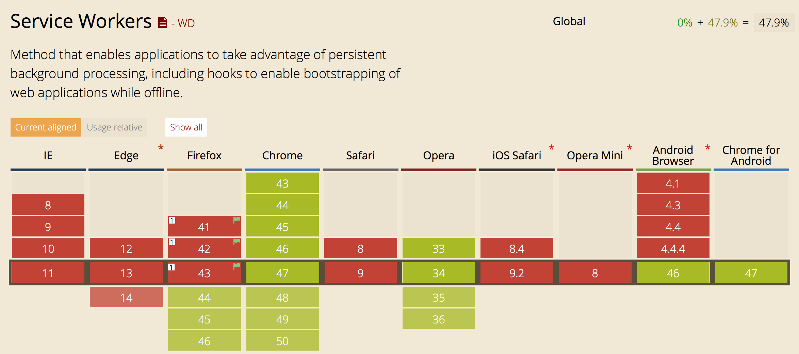

# Offline webapps

This document should cover basic of how to write offline web applications.

## TOC

1. [Intro](#intro)
2. [Online/Offline status](#onlineoffline-status)
3. [Application cache](#application-cache)
4. [Service Workers](#service-workers)
5. [Storage](#storage)
6. [localStorage](#localstorage)
7. [WebSQL](#websql)
8. [IndexedDB](#indexeddb)

## Intro

## Online/Offline status

Before we dive deep into offline web application, you would probably like to know if user is online and to receive an event when that status is changed.  
Fortunately almost all browsers implements this feature.

### `navigator.onLine` property

### `online` and `offline` events

### Demo

### Browser support

Source: [caniuse.com](http://caniuse.com/#feat=online-status); Date: 2015/12/26.

### More info

- [HTML Specs](https://html.spec.whatwg.org/multipage/browsers.html#browser-state)

[[Back to top]](#offline-webapps)

## Application cache

### Browser support

Source: [caniuse.com](http://caniuse.com/#feat=offline-apps); Date: 2015/12/26.

[[Back to top]](#offline-webapps)

## Service workers

### Browser support

Source: [caniuse.com](http://caniuse.com/#feat=serviceworkers); Date: 2015/12/26.

[[Back to top]](#offline-webapps)

## Storage

## localStorage

### Browser support

Source: [caniuse.com](http://caniuse.com/#feat=namevalue-storage); Date: 2015/12/26.

[[Back to top]](#offline-webapps)

## WebSQL

### Browser support

Source: [caniuse.com](http://caniuse.com/#feat=sql-storage); Date: 2015/12/26.

[[Back to top]](#offline-webapps)

## IndexedDB

### Browser support

Source: [caniuse.com](http://caniuse.com/#feat=indexeddb); Date: 2015/12/26.

[[Back to top]](#offline-webapps)